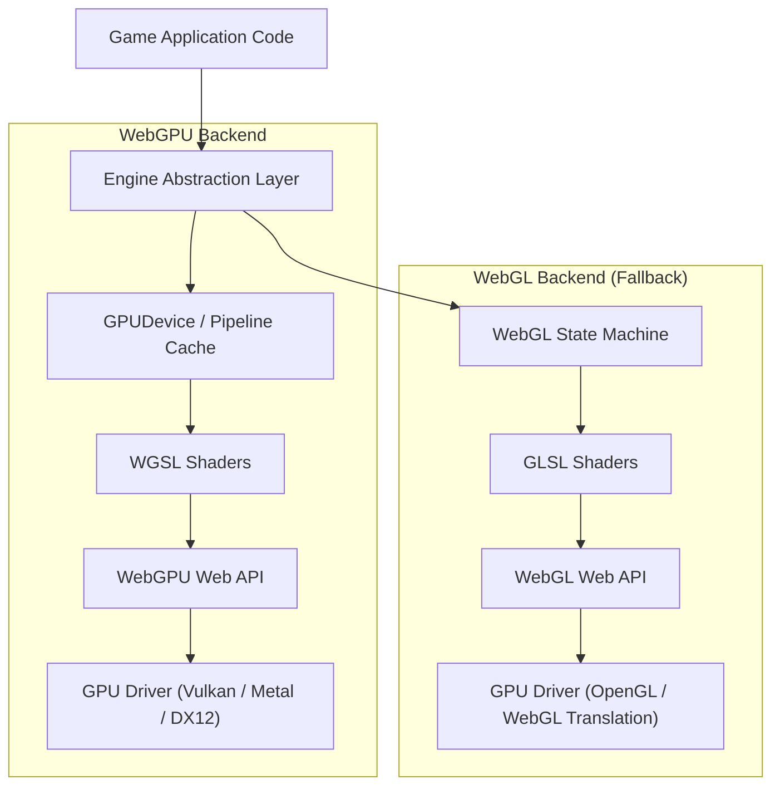
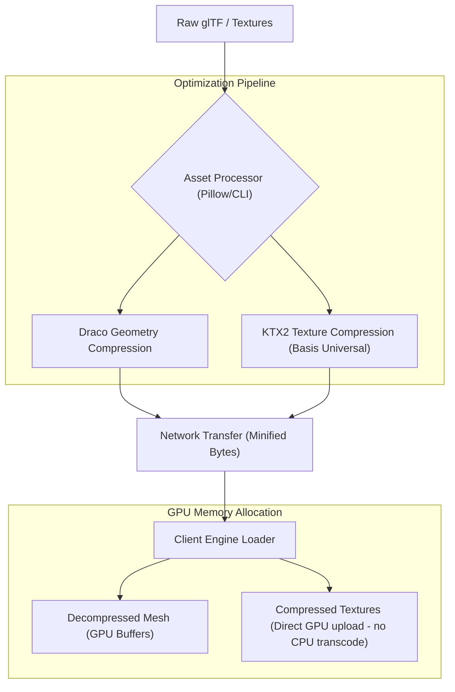

# 3D Game Engine Evaluation: Three.js vs Babylon.js vs PlayCanvas

This document evaluates the leading web-based 3D engines for **What An Adventure Games**' future 3D titles. It focuses on engine architecture, WebGPU support, mobile performance, asset pipeline workflows, and overall developer ecosystem.

---

## Executive Summary & Recommendation

For a game studio building commercial-grade, assets-heavy web 3D titles, the choice of engine determines development speed, performance ceilings, and cross-device reach.

### Studio Recommendation: **Babylon.js** (Primary) with **Three.js** (Secondary)

> [!IMPORTANT]
> **Recommendation:** **Babylon.js** is recommended as the primary engine for future major 3D games. **Three.js** is retained for lightweight interactive 3D web pages or simple retro 3D games. **PlayCanvas** is a strong contender but its proprietary cloud editor model creates vendor lock-in that limits local custom tooling.

#### Why Babylon.js?
1. **Production-Ready WebGPU:** Babylon.js has the most mature, feature-complete WebGPU implementation of the three, with seamless fallback to WebGL.
2. **Full-Featured Game Framework:** Unlike Three.js (which is a 3D library), Babylon.js includes robust built-in systems for input, audio, advanced GUI, action managers, and the industry-grade **Havok Physics** engine (via WASM).
3. **Debugging Suite:** The built-in **Babylon.js Inspector** is unparalleled. Developers can inspect scene graphs, debug shaders, profile performance, and edit materials at runtime directly inside the browser.
4. **Asset Pipeline & Material Tooling:** The **Node Material Editor** allows technical artists to visually create shaders that automatically compile to GLSL (WebGL) or WGSL (WebGPU).

---

## Technical Feature Matrix

| Feature / Criteria | Three.js | Babylon.js | PlayCanvas |
| :--- | :--- | :--- | :--- |
| **Engine Classification** | 3D Rendering Library | Complete 3D Game Framework | Visual-First Editor & Engine |
| **Primary Language** | JavaScript / TypeScript | TypeScript | JavaScript (ES6+) |
| **WebGPU Support** | Experimental / Ongoing (r152+) | Production-Ready (Stable since v5.0) | Feature-Complete Backend |
| **Physics Engines** | Third-party (cannon.js, rapier.js) | Native **Havok WASM** / Ammo.js | Native Ammo.js / PlayCanvas Physics |
| **Asset Pipeline** | Manual (Loaders for glTF, KTX2) | Integrated (Sandbox, KTX2, Draco) | Automated via Cloud Editor |
| **Bundle Size (Minified)**| ~600 KB (Core Library) | ~1.2 MB (Core + Systems) | ~400 KB (Core Engine only) |
| **IDE / Visual Editor** | Three.js Editor (Basic) | Sandbox, Node Material Editor | Collaborative Web IDE (Proprietary) |
| **Community & Ecosystem**| Massive (De facto standard) | Large, Highly Active Forums | Medium, Enterprise-Focused |
| **Licensing** | MIT (Open Source) | Apache 2.0 (Open Source) | MIT (Engine), SaaS (Editor) |

---

## Engine Architecture Profiles

### 1. Three.js
Three.js is designed as a modular 3D library rather than an all-in-one game engine. Its API is intuitive, mapping directly to graphics concepts (Scene, Camera, Renderer, Mesh, Material, Light).

* **Strengths:** Lightweight footprint, absolute flexibility, and a massive community. If you need a custom engine built from scratch (e.g., custom rendering pipelines or specialized ECS architectures), Three.js is the perfect canvas.
* **Weaknesses:** No built-in physics, UI, or audio systems. Developers must choose and integrate third-party libraries (e.g., Rapier for physics, PixiJS or custom canvas for UI), leading to integration maintenance overhead.

### 2. Babylon.js
Babylon.js is a "batteries-included" game engine. It is designed to offer everything needed to build a console-quality game in a single framework.

* **Strengths:** Out-of-the-box support for Havok physics, spatial audio, a dedicated GUI system, post-process pipelines, and advanced lighting. Its TypeScript-first architecture makes it highly maintainable for large codebases.
* **Weaknesses:** Larger initial download size than Three.js, and the API surface is extensive, requiring a steeper learning curve for simple projects.

### 3. PlayCanvas
PlayCanvas combines a lightweight open-source 3D engine with a cloud-hosted, collaborative visual editor similar to Unity or Unreal Engine.

* **Strengths:** Exceptional loading speeds, small engine footprint, visual editor that simplifies scene composition, lighting bakes, and asset management. Collaborative team features allow multiple developers to work on the same scene simultaneously.
* **Weaknesses:** The visual editor and collaboration features require a paid subscription model and host your project files on their servers. This limits custom local offline workflows, offline builds, and deep git integration.

---

## WebGPU Support Status

WebGPU is the next-generation graphics API for the web, replacing WebGL. It provides lower CPU overhead, access to modern GPU features (like compute shaders), and multi-threaded rendering capabilities.

### Engine Capabilities Comparison

#### Three.js WebGPU Status
Three.js is in the process of rebuilding its renderer. The `WebGLRenderer` is legacy, and developers are encouraged to use `WebGPURenderer` (under development) for modern projects.
- **TSL (Three Shading Language):** Introduces a node-based shader system written in JS/TS. It transpiles code dynamically into WGSL or GLSL.
- **Compute Shaders:** Supported via `ComputeNode`.
- **Verdict:** Highly promising, but APIs are currently subject to breaking changes. Not recommended for production titles launching immediately, but excellent for active R&D.

#### Babylon.js WebGPU Status
Babylon.js has first-class, production-ready WebGPU support. It implements a complete abstraction layer so that the same code runs on both WebGL and WebGPU.
- **Feature Parity:** Almost 100% feature parity between WebGL and WebGPU backends.
- **Performance:** Includes advanced features like Render Bundles (minimizing draw call overhead), Compute Shaders, and storage textures.
- **Material Support:** Standard PBR materials work on WebGPU out of the box. Custom shaders written in the Node Material Editor compile to both targets.
- **Verdict:** The gold standard for WebGPU on the web today. Ready for immediate deployment.

#### PlayCanvas WebGPU Status
PlayCanvas features a fully functional WebGPU backend that can be enabled with a configuration flag.
- **Key Features:** Supports clustered lighting (enabling hundreds of lights in a scene), compute shaders, and GPU particle systems.
- **Verdict:** Very stable and performant, particularly optimized for mobile WebGPU runtimes.

---

## Mobile Performance Analysis

Mobile execution demands careful optimization of resources due to thermal throttling, limited GPU memory, and battery constraints.

### 1. Engine Bundle & Startup Memory
* **PlayCanvas:** The lightest engine. It has a minimal loading time, and its scripts load asynchronously, which minimizes page blocking. Perfect for mobile web banner ads and instant web games.
* **Three.js:** Excellent if bundled using modern bundlers (Vite + Rollup) with tree-shaking. A bare-bones renderer is extremely light, but adding post-processing, physics, and complex controls will quickly scale the bundle size.
* **Babylon.js:** The heaviest engine. Can be optimized using ES6 imports to prune unused features (e.g., leaving out procedural textures or post-processes if not needed). Once loaded, memory management is highly optimized.

### 2. Mobile Optimization Strategies

> [!TIP]
> **Mobile Best Practices:**
> - **Direct GPU Textures:** Always compress textures to KTX2. These stay compressed in GPU memory, saving up to 75% VRAM compared to raw PNG/JPG.
> - **Draw Call Reduction:** Use mesh instancing for repetitive geometry (e.g., foliage, building blocks, projectiles). Babylon.js and Three.js both support highly optimized instanced meshes.
> - **Mesh Simplification:** Use Draco compression for models to minimize network payloads.
> - **Render Lifecycle:** In Babylon.js, use `scene.freezeActiveMeshes()` when the camera is static to skip CPU frustum culling calculations on every frame.

---

## Asset Pipeline Compatibility

All three engines prioritize **glTF 2.0 / GLB** as the industry standard. However, the integration process differs significantly.

### Asset Pipeline Workflows

#### 1. PlayCanvas Pipeline
- **Workflow:** Drag and drop assets directly into the PlayCanvas Editor.
- **Processing:** The Cloud backend automatically handles mesh optimization, generates lightmaps, transcodes textures to KTX2, and compiles materials.
- **Integration:** Visual layout and editor assignment make it extremely artist-friendly.

#### 2. Babylon.js Pipeline
- **Workflow:** Export assets as `.glb` from Blender or Maya, and load them programmatically.
- **Processing:** Utilize the standalone **Babylon.js Sandbox** to inspect, adjust materials, test animations, and export optimized configurations.
- **Texture Compression:** Fully supports KTX2 Basis textures out-of-the-box. The engine handles decompression using standard WASM transcoder files.

#### 3. Three.js Pipeline
- **Workflow:** Programmatic import via `GLTFLoader`.
- **Processing:** Requires developers to manually set up loader scripts, define path resolvers for Draco decoders (WASM), and load KTX2 transcoders.
- **Integration:** Highly customizable but requires boilerplate setup for every new project.

---

## Learning Curve & Developer Ecosystem

### Three.js
- **Learning Curve:** Low. The API is clean, and there are millions of tutorials.
- **Ecosystem:** Huge. If you run into an issue, there is a 95% chance it has been solved on Stack Overflow. Integrations like **React Three Fiber (R3F)** make it the default choice for React developers.

### Babylon.js
- **Learning Curve:** Moderate. Developers must learn the Babylon scene structure, rendering pipeline, and GUI system.
- **Ecosystem:** Excellent. The official Babylon.js Forum is exceptionally active, with core engine contributors answering questions within hours. The official Playground allows rapid prototyping with thousands of copy-pasteable examples.

### PlayCanvas
- **Learning Curve:** Low for Unity/Unreal developers (uses an Entity-Component model with a visual editor). High for developers who prefer pure code-driven, command-line-centric structures.
- **Ecosystem:** Active but smaller. Documentation is comprehensive, but the ecosystem is mostly centered around the proprietary PlayCanvas SaaS environment.

---

## Final Recommendation & Next Steps

For **What An Adventure Games**, the ideal workflow matches our technical strengths and creative goals:

1. **Adopt Babylon.js for Core 3D Titles:**
   - Setup WebGPU as the default renderer, with automatic WebGL fallback.
   - Use the Babylon.js Node Material Editor to design shaders.
   - Use Havok WASM for physics-heavy games.
2. **Develop a Structured Local Asset Pipeline:**
   - Establish Blender export guidelines targeting `.glb`.
   - Implement a post-processing script to compress textures to KTX2/Basis and geometries to Draco.
3. **Keep Three.js for Lightweight / Marketing Interactive Features:**
   - Use for quick landing pages, 3D interactive store layouts, and simple mini-games.

*Report compiled by AGY research for What An Adventure Games.*
