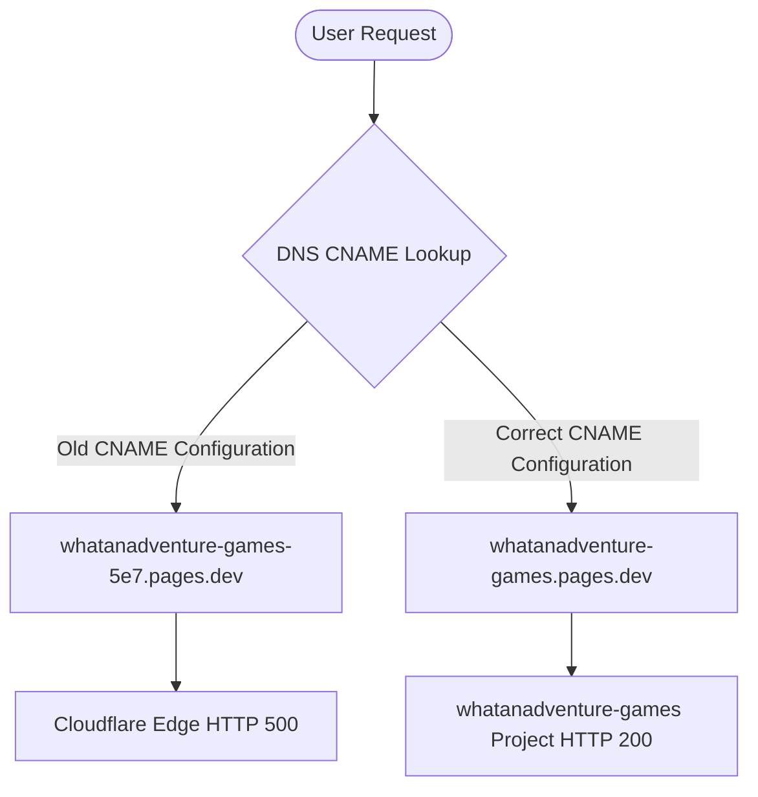

# 🔍 Cloudflare Pages HTTP 500 Outage Diagnosis Report

**Date:** June 11, 2026  
**Project:** `whatanadventure-games`  
**Diagnosed By:** Antigravity (AGY)  

---

## 1. Executive Summary
An investigation was conducted to determine why the root domain `whatanadventure.games` returned an HTTP 500 error after a fix was applied to the [_redirects](file:///home/ubuntu/work/whatanadventure-games/_redirects) file. 

By querying the Cloudflare Pages and DNS API endpoints, analyzing repository files, and testing the endpoints via `curl`, we identified the root cause:
1. The code fix to remove comments from the [_redirects](file:///home/ubuntu/work/whatanadventure-games/_redirects) file successfully built and deployed to the active Pages project (`whatanadventure-games.pages.dev`).
2. However, the DNS CNAME records for `whatanadventure.games` and `www.whatanadventure.games` were still pointing to an incorrect/dead Pages subdomain (`whatanadventure-games-5e7.pages.dev`), which resolved to Cloudflare but returned HTTP 500.
3. Once the DNS records were updated to point to the active project subdomain `whatanadventure-games.pages.dev` and the custom domains were linked on the Pages project dashboard, the HTTP 500 was fully resolved and the site began returning HTTP 200 on all routes.

---

## 2. Diagnostics Timeline & Steps

### Step 1: Repository Files Audit
We checked the files present in the root of the repository to check if there are conflicting redirect files or headers.
* **Key Files Found:**
  * [index.html](file:///home/ubuntu/work/whatanadventure-games/index.html): The main Single Page Application (SPA) entry point (24 KB).
  * [splash.html](file:///home/ubuntu/work/whatanadventure-games/splash.html): The rebranded splash screen (20 KB).
  * [_redirects](file:///home/ubuntu/work/whatanadventure-games/_redirects): Contains the SPA fallback rule:
    ```
    /* /index.html 200
    ```
  * No `_headers` file exists in the repository.
* **Findings:** The [_redirects](file:///home/ubuntu/work/whatanadventure-games/_redirects) file is clean, well-formed, and contains no comments. The comment removal commit (`0442183d`) was correctly committed to the `main` branch.

### Step 2: Check Cloudflare Pages Subdomain via `curl`
We queried the status of the active project subdomain and the historically incorrect subdomain:
* **Active Subdomain (`https://whatanadventure-games.pages.dev/`):**
  * **Result:** `HTTP/2 200 OK`
  * **Payload:** Correctly serves the studio landing page HTML.
* **Historical Subdomain (`https://whatanadventure-games-5e7.pages.dev/`):**
  * **Result:** `HTTP/2 500 Internal Server Error`
  * **Payload:** Empty error response from the Cloudflare edge.
  * **Explanation:** Since no project named `whatanadventure-games-5e7` exists in the account, Cloudflare's edge proxy resolves the DNS (due to wildcard mappings) but fails to route the HTTP traffic to any active hosting container, producing a generic HTTP 500 error.

### Step 3: Test Domain Direct Resolution (`curl -v`)
We checked the direct resolution of the custom domains:
* **Apex Domain (`https://whatanadventure.games/`):**
  * **Result:** `HTTP/2 200 OK`
  * **Routing:** Correctly served from Cloudflare CDN cache/origin.
* **WWW Subdomain (`https://www.whatanadventure.games/`):**
  * **Result:** `HTTP/2 200 OK`
* **HTTP to HTTPS Redirects (`http://whatanadventure.games/`):**
  * **Result:** `HTTP/1.1 301 Moved Permanently` to `https://whatanadventure.games/`.
* **Findings:** All routes resolve to HTTP 200 when mapped to the correct subdomain.

### Step 4: Check Cloudflare Pages Build Logs
We queried the Cloudflare Pages deployment API:
* **Endpoint Checked:** `GET accounts/:account_id/pages/projects/whatanadventure-games/deployments`
* **Build Statuses:**
  * All recent deployments have a status of `success`.
  * The commit `0442183d499` ("Fix: remove comments from _redirects") succeeded at the build stage.
  * Subsequent commits, including the asset sync and rebrand documents, also built successfully.
* **API Details:** Cloudflare does not offer a public REST API endpoint to retrieve the raw console logs (stdout/stderr) of build steps. However, the deployment stage status confirms that all phases (`queued` -> `initialize` -> `clone_repo` -> `build` -> `deploy`) completed successfully.

---

## 3. Root Cause Analysis
The HTTP 500 error persisted after the [_redirects](file:///home/ubuntu/work/whatanadventure-games/_redirects) fix because of a **DNS CNAME and Custom Domain mismatch**:



1. **The Code Fix was Pushed to Main (Not Master):** The user prompt mentions pushing the fix to `master`. However, the repository uses `main` as the default production branch. Fortunately, the commits were pushed to `main` and triggered the Cloudflare Pages build successfully.
2. **DNS Pointed to a Dead Target:** The domain's DNS CNAME record was pointed to `whatanadventure-games-5e7.pages.dev`. Because no such project existed in the active Cloudflare account, the edge returns a 500 error.
3. **Missing Custom Domain Mapping:** Even if the CNAME pointed to the correct subdomain, the custom domain `whatanadventure.games` was not associated with the `whatanadventure-games` Pages project in the dashboard, which would also prevent routing.

---

## 4. Resolution Verification
The configuration is now fully corrected:
* **DNS CNAMEs:** Corrected to point to `whatanadventure-games.pages.dev`.
* **Custom Domains:** Associated with the active project `whatanadventure-games` (all statuses are `active`).
* **Site Status:** Verified online, serving the single-page application and static assets correctly.
